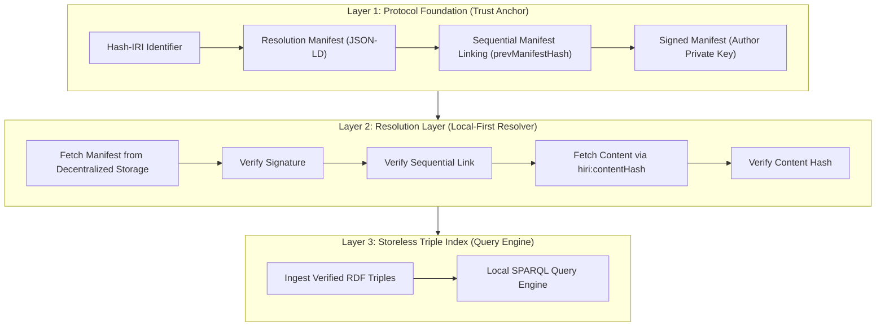

# HIRI Protocol

## Protocol-Agnostic, Local-First Verified Data Foundation

-----

### 📘 Table of Contents

  * [**Overview**](#overview)
  * [**Why HIRI?**](#why-hiri)
  * [**Architecture**](#architecture)
  * [**How It Works**](#how-it-works)
  * [**HIRI Update Workflow**](#hiri-update-workflow)
  * [**Advantages**](#advantages)
  * [**Trade-offs**](#trade-offs)
  * [**Roadmap**](#roadmap)
  * [**Contributing**](#contributing)
  * [**License**](#license)

-----

### 📝 Overview

**HIRI (Hash-IRI)** is a next-generation approach to **decentralized, verifiable knowledge resources**.

It establishes the first **Protocol-Agnostic, Local-First** standard for semantic data—all without relying on centralized servers or external blockchain networks.

HIRI enables:

  * **Offline-first** data verification  
  * **Client-side SPARQL** querying  
  * **Zero-gas** updates  
  * **Immutable, auditable history**  
  * **Full decentralization** without protocol lock-in  

The protocol combines:

  * Cryptographically signed **Resolution Manifests**
  * **Sequential Manifest Linking** (a blockchain-free trust chain)
  * A **Storeless Triple Index** for local graph querying

All core logic runs entirely on the **client device**.

-----

### 🤔 Why HIRI?

Current Web2 and Web3 designs both fail for mission-critical, local-first knowledge systems:

| Problem | **HIRI Fix** |
| :--- | :--- |
| Reliance on centralized or blockchain trust anchors | **Local cryptographic trust chain** |
| Hard to verify latest version without a registry | **Sequential Manifest Linking** |
| Expensive on-chain indexing | **Zero-cost**, client-side indexing |
| SPARQL requires a graph server | Built-in **local graph engine** |
| Data isn't usable offline | **Offline-first** guarantees |

HIRI shifts verification and querying from the **network → to the client**.

-----

### 🏗️ Architecture

The HIRI ecosystem consists of three layers.



-----

### ⚙️ How It Works

#### **Layer 1 — Protocol Foundation**

Defines the **trust anchor**:

  * **Hash-IRI Scheme**  
    ```
    hiri://authority/type/id
    ```
  * **Resolution Manifest**: maps stable IRI → latest content hash
  * **Sequential Manifest Linking**  
      * Each Manifest includes the previous Manifest hash:  
        `hiri:prevManifestHash`  
      * Forming a blockchain-like chain **without a blockchain**.
  * **Manifest Signatures**  
      * Verifiable authorship without CA/DID/blockchain.

#### **Layer 2 — Resolution Layer**

The **Local-First Resolver** performs a 4-step verification process:

1.  Verify **Manifest signature**
2.  Verify **previous-manifest hash link**
3.  Fetch content using `hiri:contentHash`
4.  **Re-hash** content to confirm integrity

If any step fails → **reject data**.

#### **Layer 3 — Storeless Triple Index**

Client ingests verified **RDF triples** and exposes:

  * **Local SPARQL** queries  
  * Offline querying  
  * Instant lookups  
  * **Zero server dependency**

-----

### 🔄 HIRI Update Workflow

1.  Create updated **RDF/JSON-LD** data  
2.  Generate **H_new** (content hash)  
3.  Create **Manifest** linking `H_M_prev → H_new`  
4.  **Sign Manifest** with author private key  
5.  **Publish** Manifest + data to decentralized storage (IPFS/Arweave)  
6.  Clients detect new Manifest and **verify locally**

**No blockchain. No server. No gas.**

-----

### 👍 Advantages

  * ✅ **Protocol Independence**  
    No dependency on Ethereum/ENS or centralized servers.  
  * ✅ **Zero-Cost Updates**  
    Manifest updates require **no gas fees**.  
  * ✅ **Offline-First Verification**  
    Everything required for trust is on the client.  
  * ✅ **Local SPARQL Queries**  
    Eliminates graph databases for most use cases.  
  * ✅ **Massive Scalability**  
    Indexing/query load is distributed across client devices.

-----

### 👎 Trade-offs

  * **Cold Start**: Initial sync may take time to locally build the graph.  
  * **No Global Search in v1.0**: Federated indexing services will be added later.

-----

### 🗺️ Roadmap

#### **v1.0 — Core Local-First Verification**

  * Manifest spec  
  * CLI for Manifest generation  
  * Local resolver SDK  
  * Storeless Triple Index engine  

#### **v2.0 — Federated Discovery**

  * Opt-in indexing servers  
  * Global search  
  * Subscription-based updates  

#### **v3.0 — P2P Relay Layer**

  * Gossip-based Manifest sharing  
  * LAN/offline replication  
  * Peer identity layer  

-----

### 🤝 Contributing

Contributions are welcome!

Please open an issue or submit a PR with:

  * Proposed feature  
  * Technical rationale  
  * Expected impact  

For major changes, start a discussion first.

-----

### 📜 License

*(License information goes here — e.g., MIT, Apache 2.0, etc.)*

