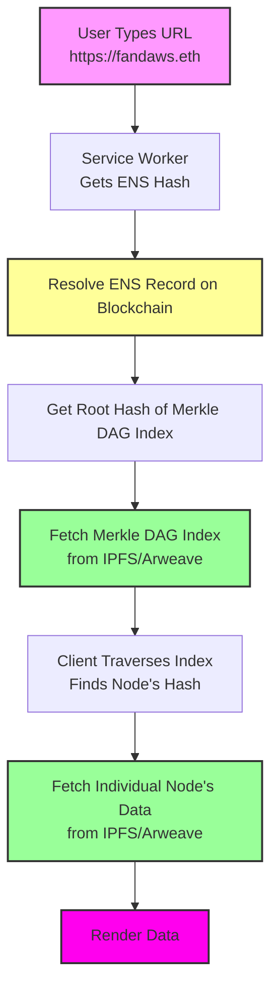

### **Fandaws Decentralized RDF Infrastructure & Fanlink: The Real-Time Semantic Web Interface**

-----

### **Executive Summary**

Fandaws and Fanlink together propose a fully decentralized, scalable, and persistent ecosystem for semantic web resources. **Fandaws** provides the core infrastructure: a vast, off-chain content-addressed index anchored by a single on-chain record. This design ensures that global semantic data is scalable and resistant to censorship.

**Fanlink** is the dynamic, real-time instance service built on top of Fandaws. It provides the interface to manage, query, and update individual ontological instances on demand. By separating the foundational infrastructure from the real-time interaction layer, the system can scale to billions of nodes without incurring prohibitive costs or sacrificing data integrity.

-----

### **Problem Statement**

Traditional web hosting for semantic resources faces several limitations:

  * **Single points of failure:** Reliance on centralized servers for DNS-based pointers or HTTP redirects creates a single, vulnerable point.
  * **DDoS vulnerability:** Centralized endpoints are susceptible to attacks, making resources unavailable.
  * **Ephemeral persistence:** Data can be lost or deleted if hosting providers fail or change their policies.
  * **Cost and Scalability:** A one-to-one on-chain mapping for millions or billions of records is economically unfeasible due to high transaction fees.
  * **Static Infrastructure:** Immutable infrastructure is poorly suited for the dynamic, real-time management of changing data instances.

This whitepaper presents Fandaws as a scalable infrastructure solution and Fanlink as the dynamic layer that solves the challenges of real-time interaction.

-----

### **Technical Vision: A Scalable, Layered Ecosystem**

The ecosystem is divided into two distinct but interconnected services.

#### **Fandaws: The Core Infrastructure**

Fandaws separates the trust anchor (on-chain) from the data management and scalability layers (off-chain) to ensure both integrity and performance.

  * **Layer 1: The On-Chain Trust Anchor:** This layer uses a single, immutable record on the Ethereum blockchain to serve as the cryptographic root. A single ENS domain, `fandaws.eth`, is registered to point to the root hash of the off-chain index. This provides an unbreakable, decentralized link to the latest version of the entire Fandaws knowledge graph.
  * **Layer 2: The Scalable Off-Chain Index:** This layer is a massive, content-addressed Merkle DAG that efficiently manages billions of semantic nodes. It serves as the primary index for the entire system, ensuring scalability and persistence.
  * **Layer 3: The Data:** This layer contains the actual immutable RDF records, compressed with zlib and stored on IPFS/Arweave.

#### **Fanlink: The Real-Time Instance Service**

Fanlink is the dynamic interface that sits on top of the Fandaws infrastructure, providing the tools and protocols for real-time interaction with data instances.

  * **Instance Management API:** Fanlink provides a set of APIs and tools for creating, updating, and querying individual ontological instances. This is where the core logic for the **"Compress and Hash"** and **"Update the Index"** workflow lives.
  * **Service Worker Proxy:** A JavaScript Service Worker is deployed with the Fanlink client. It acts as the front-end for the user, intercepting requests to `fandaws.eth` and translating them into lookups on the Fandaws infrastructure. This provides a seamless, server-less experience for the end user.

-----

### **Fanlink Workflow: Creating a New Node**

The workflow for creating and adding a new node to the ecosystem is a multi-step process that occurs primarily within the Fanlink service.

1.  **Create the Instance Data:** A new RDF instance, such as a "house" node, is created in a format like Turtle.
2.  **Compress and Hash:** The raw data is compressed with `zlib` and added to IPFS via a Fanlink API call. IPFS computes a Content Identifier (CID), which is the immutable URL for that instance's data.
3.  **Update the Fandaws Index:** Fanlink adds the new CID for the house node to the off-chain Merkle DAG index. This process is highly efficient, as it only changes the hashes of the parent nodes leading back to the index's root.
4.  **Update the On-Chain Pointer (if needed):** On a scheduled basis, or after a significant number of updates, Fanlink updates the root hash of the entire Merkle DAG on the `fandaws.eth` ENS record. This single transaction confirms the integrity of all updates made to the knowledge graph.

-----

### **Downstream Consequences & Analysis**

This two-tiered model is a strategic choice with significant advantages and trade-offs.

#### **Advantages:**

  * **Separation of Concerns:** The architecture cleanly separates the core infrastructure (Fandaws) from the dynamic application layer (Fanlink). This allows each component to be optimized for its specific purpose.
  * **Massive Scalability:** The architecture can handle billions of nodes, as the cost is tied to data size, not the number of individual records. This makes the project economically viable at a global scale.
  * **Cost Efficiency:** The cost of an ENS record is now a negligible one-time fee, and the primary cost is for data storage and indexing, which is far cheaper than on-chain gas fees.

#### **Disadvantages:**

  * **Increased Architectural Complexity:** This model is more complex to build and maintain, as it requires managing two distinct but interdependent services.
  * **The Cold Start Problem:** The Service Worker solution still has the cold start problem, where a user must initially visit a public gateway URL to install the Service Worker.

-----

### **Appendix: Merkle DAG Resolution Diagram**

-----

### **Conclusion**

The Fandaws and Fanlink ecosystem represents the most viable path forward for a large-scale decentralized knowledge graph. It leverages the unique strengths of ENS for security and IPFS for scalability, creating a robust, cost-effective, and censorship-resistant solution. This approach can serve as a reliable, next-generation semantic web infrastructure, capable of supporting a wide range of decentralized applications and critical knowledge systems.

-----

### **Future Vision and Governance**

To ensure the long-term viability of Fandaws and Fanlink, the project will transition to a decentralized governance model. The founding team will establish a **Decentralized Autonomous Organization (DAO)** to manage the ENS domain, cover ongoing pinning and Arweave costs, and fund future development. Community members will be able to vote on key proposals, ensuring the project remains transparent, resilient, and independent of any single entity.
