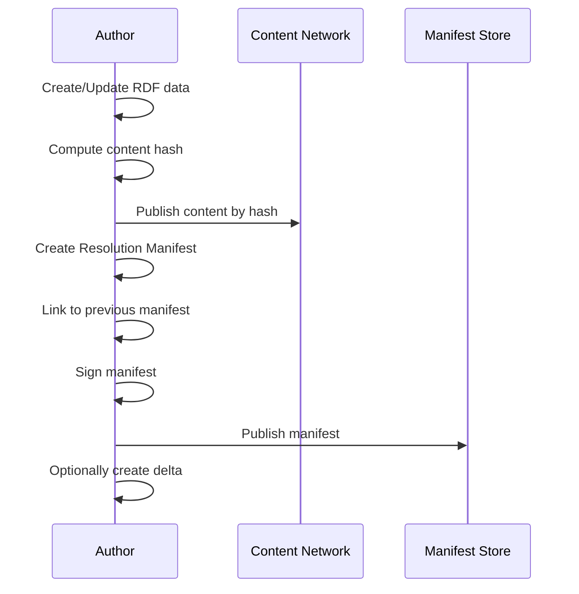
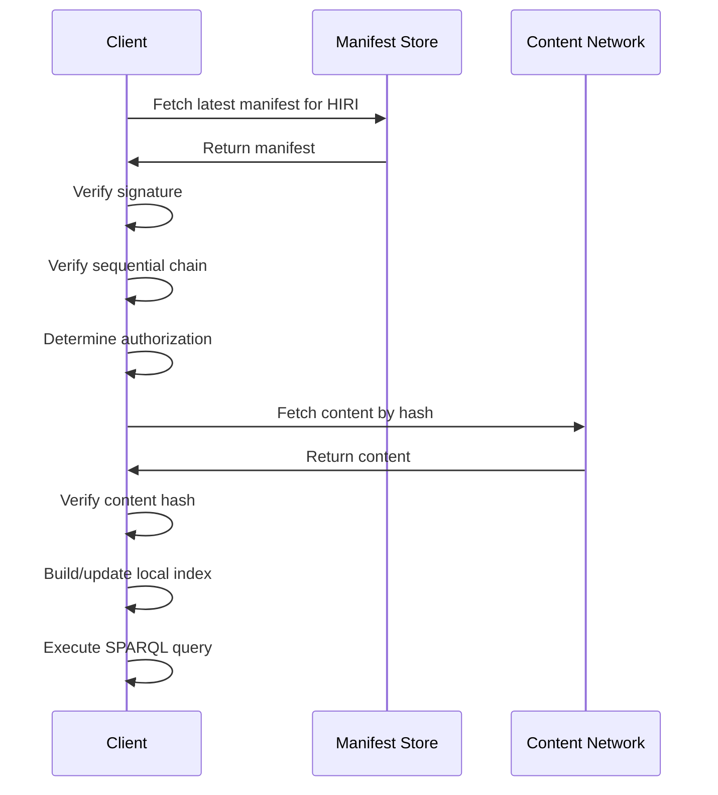
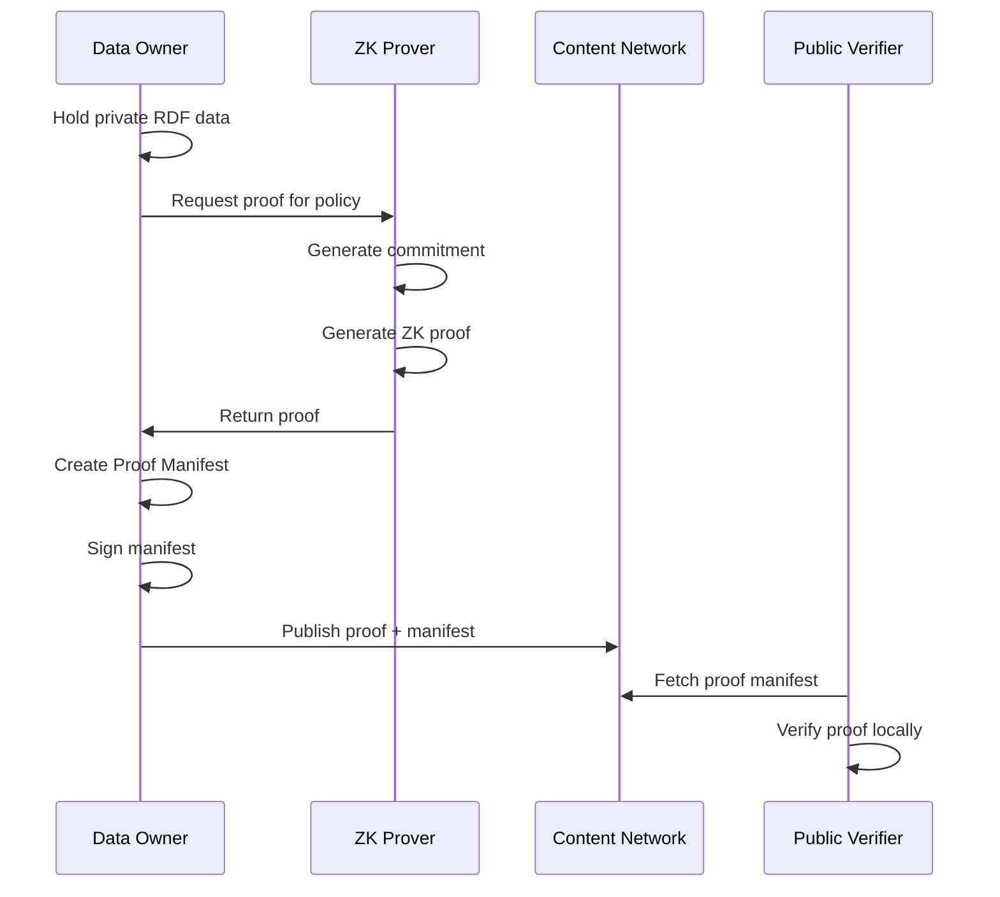
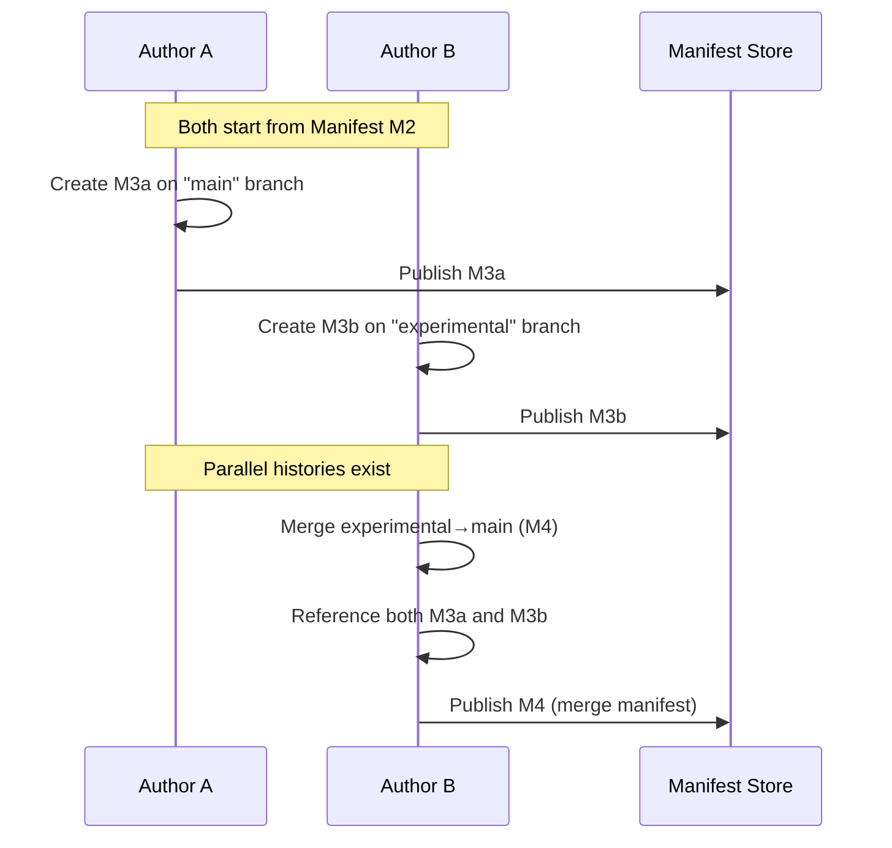

# HIRI: Hash-IRI Protocol
## A Protocol-Agnostic, Local-First, Verifiable Knowledge & Claim Foundation

**Version:** 0.9.0 (Draft for Community Review)  
**Status:** Request for Comments  
**Authors:** Open for collaborative attribution

---

## 📘 Table of Contents

1. [Overview](#overview)
2. [Motivation](#motivation)
3. [Core Design Principles](#core-design-principles)
4. [Architecture](#architecture)
5. [Specification](#specification)
6. [Zero-Knowledge Claims Layer](#zero-knowledge-claims-layer)
7. [Workflows](#workflows)
8. [Query Model](#query-model)
9. [Advantages & Trade-offs](#advantages--trade-offs)
10. [Open Questions & Community Input](#open-questions--community-input)
11. [Roadmap](#roadmap)
12. [Contributing](#contributing)
13. [License](#license)

---

## 📝 Overview

**HIRI (Hash-IRI)** is a protocol for decentralized, verifiable knowledge and claims that operates **local-first**, **offline-capable**, and without dependence on centralized servers, blockchains, or protocol-specific trust anchors.

### Core Capabilities

- **Offline-first verification** of data integrity and authorship
- **Client-side SPARQL querying** without graph servers
- **Zero-cost updates** with no global consensus required
- **Immutable, auditable history** through sequential manifest linking
- **Privacy-preserving public verification** using zero-knowledge proofs
- **Protocol independence** with no lock-in to specific networks or technologies

HIRI shifts verification, querying, and trust resolution from the network to the client, while enabling selective public truth without requiring public disclosure of private data.

---

## 🤔 Motivation

### The Problem Space

Modern knowledge systems fail in complementary ways:

| System Type | Failure Mode | Impact |
|-------------|--------------|---------|
| **Web2 Centralized** | Trust anchored in servers | Single points of failure, surveillance |
| **Blockchain/Web3** | Trust anchored in global consensus | Expensive, slow, environmentally costly |
| **Semantic Web** | Trust anchored in HTTP authorities | Offline unusable, mutable references |
| **P2P Networks** | Trust anchored in social graphs | Inconsistent, partition-prone |

### The Core Insight

**Data access and truth verification are not the same problem.**

Most systems conflate these concerns. HIRI recognizes that:

- **Data access** is about authorization, storage, and retrieval
- **Truth verification** is about cryptographic integrity and provenance

By separating these concerns, HIRI enables:
- Private data with public verifiable claims
- Offline verification without online dependencies
- Local querying without centralized infrastructure
- Immutable history without blockchains

---

## 🧠 Core Design Principles

### 1. Local-First Verification
All trust decisions are made on the client using cryptographic primitives. No network dependency for verification.

### 2. Content-Addressed Truth
Hashes, not servers or authorities, define integrity. URIs are stable, content is immutable.

### 3. Sequential History Without Consensus
Version chains provide tamper-evident history without requiring global agreement or blockchain infrastructure.

### 4. Storeless Knowledge
RDF graphs are queryable on the client without requiring a triple store server.

### 5. Separation of Data and Claims
Private data may exist without public exposure. Public claims may exist without revealing underlying data.

### 6. Provable Truth Without Disclosure
Zero-knowledge proofs allow public verification of properties without revealing the data itself.

### 7. Protocol Agnosticism
No lock-in to specific cryptographic systems, storage networks, or trust models.

### 8. Simplicity and Openness
Prefer simple, composable primitives over complex, monolithic solutions.

---

## 🏗️ Architecture

HIRI consists of four layers, all operating primarily on the client:

```
┌─────────────────────────────────────────────┐
│  Layer 4: Query & Verification              │
│  • Local SPARQL                             │
│  • ZK Proof Verification                    │
│  • Policy Evaluation                        │
└─────────────────────────────────────────────┘
                    ▲
┌─────────────────────────────────────────────┐
│  Layer 3: Storeless Index                   │
│  • Private/Authorized RDF Index             │
│  • Public Proof Index                       │
│  • Delta Application                        │
└─────────────────────────────────────────────┘
                    ▲
┌─────────────────────────────────────────────┐
│  Layer 2: Resolution Layer                  │
│  • Manifest Fetch                           │
│  • Signature Verification                   │
│  • Sequential Link Verification             │
│  • Content Fetch & Hash Verification        │
└─────────────────────────────────────────────┘
                    ▲
┌─────────────────────────────────────────────┐
│  Layer 1: Protocol Foundation               │
│  • Hash-IRI Identifiers                     │
│  • Resolution Manifests                     │
│  • Proof Manifests                          │
│  • Sequential Linking                       │
└─────────────────────────────────────────────┘
```

---

## ⚙️ Specification

### Layer 1: Protocol Foundation

#### Hash-IRI Scheme

HIRI uses a stable identifier scheme:

```
hiri://authority/type/identifier
```

**Components:**
- `authority`: Publisher domain or public key hash (e.g., `example.org` or `pk:abc123...`)
- `type`: Resource type (e.g., `data`, `proof`, `policy`)
- `identifier`: Unique identifier within authority scope

**Examples:**
```
hiri://example.org/data/Person123
hiri://pk:abc123.../proof/AgeVerification
hiri://shared.org/policy/Over21
```

#### Resolution Manifest

A Resolution Manifest maps a stable HIRI to versioned content.

**Core Structure:**

```json
{
  "@context": "https://hiri-protocol.org/spec/v1",
  "@id": "hiri://example.org/data/Person123",
  "@type": "hiri:ResolutionManifest",
  
  "hiri:version": "5",
  "hiri:timestamp": "2024-01-15T14:30:00Z",
  "hiri:branch": "main",
  
  "hiri:content": {
    "hash": "Qmb4pXH3...",
    "algorithm": "sha256",
    "format": "application/ld+json"
  },
  
  "hiri:delta": {
    "hash": "QmDelta...",
    "format": "rdf-patch",
    "appliesTo": "Qmb4pXH2..."
  },
  
  "hiri:contentLayers": {
    "public": {
      "hash": "QmPublic...",
      "authorization": "none"
    },
    "registered": {
      "hash": "QmRegistered...",
      "authorization": "role:registered"
    }
  },
  
  "hiri:prevManifestHash": "QmPrevious...",
  "hiri:prevManifestBranch": "main",
  
  "hiri:signature": {
    "algorithm": "ed25519",
    "publicKey": "0x123abc...",
    "value": "0x456def..."
  }
}
```

**Key Fields:**

- **version**: Monotonically increasing version number
- **timestamp**: ISO 8601 timestamp (advisory, not trusted)
- **branch**: Branch name for parallel development (defaults to "main")
- **content**: Primary content reference
  - **hash**: Content-addressed hash
  - **algorithm**: Hash algorithm used
  - **format**: MIME type
- **delta** (optional): Incremental update from previous version
  - Enables efficient client-side updates
  - Full content always available as fallback
- **contentLayers** (optional): Multi-level authorization
  - Each layer independently content-addressed
  - Clients fetch only authorized layers
- **prevManifestHash**: Link to previous manifest (creates chain)
- **signature**: Cryptographic signature over entire manifest

#### Proof Manifest

A Proof Manifest represents a verifiable claim using zero-knowledge proofs.

**Core Structure:**

```json
{
  "@context": "https://hiri-protocol.org/spec/v1",
  "@id": "hiri://example.org/proof/AgeVerification/Person123",
  "@type": "hiri:ProofManifest",
  
  "hiri:version": "1",
  "hiri:timestamp": "2024-01-15T14:35:00Z",
  
  "hiri:proves": "hiri://shared.org/policy/Over21",
  "hiri:about": "public:PersonRef_ABC",
  
  "hiri:proofSystem": {
    "@id": "proof-system:groth16-bn254",
    "verifierCode": "ipfs://QmVerifier...",
    "verifierFormat": "wasm"
  },
  
  "hiri:proof": {
    "hash": "QmProof...",
    "format": "application/json"
  },
  
  "hiri:publicInputs": {
    "commitment": "0x789abc...",
    "policyHash": "QmPolicy..."
  },
  
  "hiri:generatedFrom": "hiri://example.org/commitment/C123",
  
  "hiri:prevManifestHash": "QmPrevProof...",
  
  "hiri:signature": {
    "algorithm": "ed25519",
    "publicKey": "0x123abc...",
    "value": "0x456def..."
  }
}
```

**Key Fields:**

- **proves**: Reference to policy being satisfied
- **about**: Public reference to subject (no PII)
- **proofSystem**: References the specific ZK system
  - Includes content-addressed verifier code
- **proof**: Content-addressed proof artifact
- **publicInputs**: Public parameters for verification
- **generatedFrom**: Optional reference to commitment

---

### Layer 2: Resolution Layer

The client resolves any HIRI artifact through deterministic local verification:

#### Resolution Algorithm

```
function resolve(hiri_uri):
  1. Fetch latest manifest for hiri_uri
  2. Verify manifest signature
     - Extract public key
     - Verify signature over manifest
     - REJECT if invalid
  
  3. Verify sequential chain (if not genesis)
     - Fetch previous manifest
     - Verify prevManifestHash matches
     - Recursively verify chain (with depth limit)
     - REJECT if chain broken
  
  4. Determine authorization level
     - Check client credentials
     - Select appropriate content layer
  
  5. Fetch content
     - Try delta application if available
     - Fallback to full content
     - Fetch from content-addressed network
  
  6. Verify content hash
     - Recompute hash of fetched content
     - Compare to manifest hash
     - REJECT if mismatch
  
  7. If proof manifest:
     - Fetch verifier code
     - Verify verifier code hash
     - Execute proof verification
     - REJECT if proof invalid
  
  8. Return verified content
```

**Verification is deterministic and offline-capable** (assuming cached content).

---

### Layer 3: Storeless Index

HIRI clients maintain local indices without requiring server infrastructure.

#### Index Architecture

Clients maintain **two logically isolated indices**:

**1. Private/Authorized RDF Index**
- Contains full semantic data
- Access-controlled based on authorization
- Built from authorized content layers
- Supports SPARQL queries
- Never exposed to public

**2. Public Proof Index**
- Contains zero-knowledge proofs and policies
- No personal data
- Publicly readable
- Verifiable by anyone
- Separate from data index

**These indices never join.** This separation is fundamental to privacy.

#### Index Building Process

```
function buildIndex(manifest):
  1. Resolve manifest to content
  2. Determine content type (data vs proof)
  3. If data content:
     - Parse RDF/JSON-LD
     - Add triples to private index
     - Apply authorization filters
  4. If proof content:
     - Verify proof validity
     - Add to public proof index
     - Index by policy, subject, timestamp
  5. Update index metadata
     - Record manifest hash
     - Record timestamp
     - Enable incremental updates
```

#### Incremental Updates

Clients can efficiently update their indices without full re-materialization:

```
function updateIndex(newManifest, currentIndex):
  1. Check if newManifest.prevManifestHash matches currentIndex.lastManifest
  2. If delta available:
     - Fetch delta content
     - Verify delta hash
     - Apply RDF patch or JSON patch
     - Update affected index entries only
  3. Else:
     - Fetch full content
     - Rebuild relevant index sections
  4. Periodically verify full content hash (corruption detection)
  5. Update index metadata
```

**Benefits:**
- Efficient bandwidth usage
- Fast updates for large graphs
- Optional optimization (deltas not required)

**Trade-offs:**
- Publishers must generate deltas
- Clients must implement patch application
- Periodic full verification recommended

---

### Layer 4: Query & Verification

#### SPARQL Query Execution

Clients execute SPARQL queries entirely locally:

```sparql
PREFIX ex: <http://example.org/vocab#>
PREFIX hiri: <https://hiri-protocol.org/vocab#>

SELECT ?name ?email WHERE {
  ?person ex:name ?name ;
          ex:email ?email ;
          ex:department "Engineering" .
}
```

**Query Resolution:**
1. Query executed against local RDF index
2. Results filtered by authorization level
3. No network requests for query execution
4. Offline-capable

#### Proof Verification

Verifying a public claim:

```
function verifyProofClaim(proofManifest):
  1. Resolve proof manifest
  2. Fetch proof system verifier code
  3. Verify verifier code hash matches manifest
  4. Load verifier (WASM, JS, or native)
  5. Execute verifier with:
     - Public inputs from manifest
     - Proof artifact
  6. Return verification result (boolean)
```

**Key Properties:**
- No access to private data required
- Deterministic verification
- Reproducible by any party
- Offline-capable (with cached verifier)

---

## 🔐 Zero-Knowledge Claims Layer

### Overview

HIRI natively supports zero-knowledge proofs as first-class artifacts, enabling:

> **"Public verification that private data satisfies a policy—without revealing the data."**

### Key Concepts

#### 1. Commitment

A cryptographic binding to private data that reveals nothing about the data itself.

```json
{
  "@id": "hiri://example.org/commitment/C123",
  "@type": "hiri:Commitment",
  "hiri:commitmentValue": "0x789abc...",
  "hiri:algorithm": "pedersen-bn254",
  "hiri:generatedAt": "2024-01-15T14:00:00Z"
}
```

#### 2. Policy

A public, deterministic rule that data may satisfy.

```json
{
  "@id": "hiri://shared.org/policy/Over21",
  "@type": "hiri:Policy",
  "hiri:description": "Subject is 21 years or older",
  "hiri:constraint": {
    "property": "birthDate",
    "operator": "before",
    "reference": "currentDate - 21 years"
  },
  "hiri:policyHash": "QmPolicy...",
  "hiri:proofSystemCompatible": [
    "proof-system:groth16-bn254",
    "proof-system:plonk"
  ]
}
```

#### 3. Proof

Cryptographic evidence that private data satisfies a policy.

**Properties:**
- Bound to a commitment
- References a public policy
- Verifiable without accessing data
- Non-interactive (can be verified offline)

### Proof System Registry

HIRI doesn't mandate specific ZK systems but defines a minimal interface:

```json
{
  "@context": "https://hiri-protocol.org/spec/proof-system/v1",
  "@id": "proof-system:groth16-bn254",
  "@type": "hiri:ProofSystem",
  
  "hiri:name": "Groth16 over BN254",
  "hiri:verifierCode": "ipfs://QmVerifier...",
  "hiri:verifierFormat": "wasm",
  "hiri:verifierHash": "sha256:abc123...",
  
  "hiri:interface": {
    "publicInputs": ["commitment", "policyHash"],
    "proofFormat": "bytes",
    "outputFormat": "boolean"
  },
  
  "hiri:documentation": "ipfs://QmDocs...",
  "hiri:securityAssumptions": [
    "discrete-log-bn254",
    "trusted-setup-required"
  ]
}
```

**Key Points:**
- Verifier code is content-addressed
- No trust beyond cryptography
- Multiple proof systems can coexist
- Applications choose appropriate systems

### Privacy Budget Management

**The Challenge:** Even if individual proofs reveal nothing, collections of proofs about the same subject can narrow identity through inference.

**Proposed Solution:** Proof budget tracking (not enforced by protocol, but supported):

```json
{
  "@id": "hiri://example.org/proof-policy/PersonProofs",
  "@type": "hiri:ProofPolicy",
  
  "hiri:subject": "public:PersonRef_ABC",
  "hiri:privacyBudget": {
    "epsilon": 2.0,
    "delta": 0.0001,
    "mechanism": "differential-privacy"
  },
  
  "hiri:proofLimits": {
    "total": 10,
    "byCategory": {
      "age": 2,
      "location": 1,
      "employment": 3,
      "education": 2
    }
  },
  
  "hiri:currentUsage": {
    "total": 5,
    "byCategory": {
      "age": 1,
      "location": 1,
      "employment": 2
    }
  }
}
```

**HIRI's Approach:**
- Protocol provides primitives for tracking
- Applications enforce policies
- Community develops formal privacy analysis
- No one-size-fits-all solution

**Open Research Area:** Formal bounds on safe proof combinations remain an active area of cryptographic research. HIRI provides tools but doesn't claim to solve this fundamentally.

---

## 🔄 Workflows

### Workflow 1: Publishing Data



**Steps:**
1. Author creates or updates RDF/JSON-LD content
2. Compute cryptographic hash of content
3. Publish content to content-addressed network (IPFS, S3, etc.)
4. Create Resolution Manifest:
   - Reference content hash
   - Link to previous manifest (if exists)
   - Set version, timestamp, branch
5. Sign manifest with private key
6. Publish manifest (any distribution method)
7. Optionally create and publish delta from previous version

**No blockchain. No servers. No gas. No global state.**

### Workflow 2: Resolving Data



**Steps:**
1. Client fetches latest manifest for HIRI
2. Verifies manifest signature (cryptographic authenticity)
3. Verifies sequential chain (tamper detection)
4. Determines client's authorization level
5. Fetches appropriate content layer by hash
6. Verifies content hash matches manifest
7. Adds to local RDF index
8. Executes queries locally

**All verification is local and deterministic.**

### Workflow 3: Generating Zero-Knowledge Proof



**Steps:**
1. Data owner holds private RDF data (never published)
2. Owner evaluates data against public policy
3. ZK system generates:
   - Commitment to private data
   - Proof that policy is satisfied
4. Owner creates Proof Manifest:
   - References policy
   - References proof system
   - Includes public inputs
5. Owner signs and publishes manifest
6. Anyone can verify proof without accessing private data

**Privacy-preserving public truth.**

### Workflow 4: Branch Management



**Branch Support:**
- Parallel development without coordination
- Explicit merge manifests reference multiple parents
- Clients can track and query specific branches
- Authority determines canonical branch

**Merge Manifest Example:**
```json
{
  "@id": "hiri://example.org/data/Person123",
  "@type": "hiri:ResolutionManifest",
  "hiri:version": "7",
  "hiri:branch": "main",
  "hiri:mergeOf": [
    {
      "manifestHash": "QmM6a...",
      "branch": "main"
    },
    {
      "manifestHash": "QmM6b...",
      "branch": "experimental"
    }
  ],
  "hiri:content": {
    "hash": "QmMerged..."
  },
  "hiri:signature": {...}
}
```

---

## 🔎 Query Model

### Authorized Query (Private Data)

Only clients with appropriate authorization can execute:

```sparql
PREFIX ex: <http://example.org/vocab#>

SELECT ?dob ?address ?ssn WHERE {
  :Person123 ex:birthDate ?dob ;
             ex:address ?address ;
             ex:ssn ?ssn .
}
```

**Properties:**
- Requires authorization credentials
- Executes against private RDF index
- Full data access for authorized clients
- Results never leave client device

### Public Proof Query

Anyone can verify public claims:

```sparql
PREFIX hiri: <https://hiri-protocol.org/vocab#>
PREFIX policy: <https://shared.org/policy#>

ASK {
  ?proof a hiri:ProofManifest ;
         hiri:proves policy:Over21 ;
         hiri:about <public:PersonRef_ABC> ;
         hiri:verifiedAt ?timestamp .
}
```

**Properties:**
- No authorization required
- Executes against public proof index
- Learns exactly one fact: claim is verified
- No access to underlying data

### Hybrid Query Pattern

Applications may combine both:

```sparql
# Authorized client checking own compliance
PREFIX ex: <http://example.org/vocab#>
PREFIX hiri: <https://hiri-protocol.org/vocab#>

SELECT ?requirement ?proofExists WHERE {
  # Private data query
  :Person123 ex:requiredCompliance ?requirement .
  
  # Check if proof exists (public index)
  OPTIONAL {
    ?proof hiri:proves ?requirement ;
           hiri:about <public:PersonRef_ABC> .
    BIND(true AS ?proofExists)
  }
}
```

**Use Case:** Personal compliance dashboard showing which requirements are proven vs. unproven.

---

## 👍 Advantages & Trade-offs

### Advantages

✅ **Offline-First Verification**
- No network dependency for trust decisions
- Works in disconnected environments
- Resilient to network failures

✅ **Protocol Independence**
- No lock-in to specific blockchains, storage, or networks
- Works with any content-addressed storage
- Interoperable across ecosystems

✅ **Zero-Cost Updates**
- No transaction fees
- No mining/staking costs
- Update at the speed of publishing

✅ **No Centralized Trust**
- Cryptographic verification only
- No trusted authorities required
- No single points of failure

✅ **Privacy-Preserving Public Truth**
- Zero-knowledge proofs enable verification without disclosure
- Separate data and claims indices
- Granular access control

✅ **Scales with Users, Not Servers**
- Clients do the work
- No centralized infrastructure bottleneck
- Naturally distributed

✅ **Immutable History**
- Sequential manifest chains prevent tampering
- Auditable provenance
- No blockchain overhead

### Trade-offs

⚠️ **Cold-Start Synchronization Cost**
- New clients must fetch and verify manifest chains
- Mitigated by: delta updates, pruning strategies, trusted checkpoints

⚠️ **Predicate Governance Required**
- Public proof policies need careful design
- Mitigated by: community policy libraries, formal analysis tools

⚠️ **No Arbitrary Public Analytics**
- Public users can only verify specific claims, not analyze full data
- This is intentional: privacy by design

⚠️ **Proof Accumulation Risk**
- Many proofs about one subject may enable inference
- Mitigated by: proof budgets, privacy analysis, application policies

⚠️ **Branch Coordination**
- Parallel updates create divergent histories
- Mitigated by: explicit branch semantics, merge manifests, authority designation

⚠️ **Verifier Trust Assumption**
- Clients must trust proof system verifier code correctness
- Mitigated by: content-addressed verifiers, community audits, multiple implementations

**These are intentional constraints that prioritize privacy, decentralization, and offline capability over convenience.**

---

## 🤝 Open Questions & Community Input

HIRI is designed for collaborative development. The following areas require community input:

### 1. Branch Merge Semantics

**Question:** Should HIRI specify automatic conflict resolution strategies, or leave this to applications?

**Current Proposal:** Support merge manifests that reference multiple parents, but don't mandate resolution logic.

**Community Input Needed:**
- Real-world use cases for collaborative editing
- Conflict resolution patterns from practice
- Trade-offs between simplicity and functionality

### 2. Proof System Priorities

**Question:** Which zero-knowledge proof systems should have reference implementations first?

**Candidates:**
- Groth16 (mature, fast verification)
- PLONK (no trusted setup, flexible)
- Bulletproofs (no trusted setup, range proofs)
- STARKs (quantum-resistant, no trusted setup)

**Community Input Needed:**
- Performance requirements for different use cases
- Security assumption preferences
- Tooling maturity and developer experience

### 3. Privacy Budget Formalization

**Question:** Can we develop formal bounds on safe proof combinations?

**Challenge:** Even zero-knowledge proofs can reveal information through accumulation.

**Current Approach:** Provide primitives for tracking, leave enforcement to applications.

**Community Input Needed:**
- Cryptographers to analyze information leakage
- Formal methods for proving privacy guarantees
- Practical patterns for real-world applications

### 4. Authorization Models

**Question:** What authorization patterns are most useful for content layers?

**Current Support:** Role-based layers (public, registered, admin).

**Community Input Needed:**
- Capability-based access control patterns
- Delegation and temporary access
- Revocation strategies

### 5. Manifest Distribution

**Question:** What's the best way to distribute and discover manifests?

**Options:**
- DNS TXT records
- IPNS (IPFS name system)
- WebFinger protocol
- Dedicated manifest servers
- P2P gossip protocols

**Community Input Needed:**
- Trade-offs for different deployment contexts
- Censorship resistance requirements
- Performance and availability needs

### 6. Delta Format Standardization

**Question:** Should HIRI standardize delta formats, or remain agnostic?

**Candidates:**
- RDF Patch (W3C draft)
- JSON Patch (RFC 6902)
- Application-specific formats

**Community Input Needed:**
- Performance of different formats for various graph sizes
- Tooling availability
- Semantic preservation guarantees

---

## 🗺️ Roadmap

### Phase 1: Core Specification (Q1 2025)
- **Milestone:** v1.0 specification release
- Formalize manifest structure
- Define minimal ZK interface
- Publish as RFC for community review
- Establish governance process

**Deliverables:**
- Formal specification document
- JSON Schema for manifests
- Test vectors for verification
- Security considerations document

### Phase 2: Reference Implementation (Q2-Q3 2025)
- **Milestone:** Working client resolver
- TypeScript/Rust client library
- Basic RDF index builder
- Example integration with one ZK system (Groth16)
- Command-line tools

**Deliverables:**
- Open-source client library
- Developer documentation
- Tutorial and examples
- Basic test suite

### Phase 3: Protocol Extensions (Q4 2025)
- **Milestone:** Production-ready features
- Branch semantics implementation
- Delta update support
- Multi-layer authorization
- Performance optimizations

**Deliverables:**
- Enhanced client library
- Performance benchmarks
- Extended examples
- Migration guides

### Phase 4: Ecosystem Development (2026)
- **Milestone:** Thriving community
- Multiple client implementations
- Proof system registry
- Policy library
- Community governance

**Deliverables:**
- Multi-language implementations
- Standard policy catalog
- Security audit results
- Case studies and adoption stories

### Future Considerations
- Federated discovery mechanisms
- P2P manifest relay
- Advanced privacy techniques (homomorphic encryption, secure multi-party computation)
- Integration with existing semantic web infrastructure
- AI/ML model provenance and verification

---

## 🤝 Contributing

HIRI is an open protocol developed collaboratively. We welcome contributions in:

### Specification Development
- Protocol clarity and formalization
- Security analysis
- Privacy analysis
- Use case documentation

### Implementation
- Client libraries (any language)
- ZK proof system integrations
- Tooling and utilities
- Testing infrastructure

### Research
- Privacy-preserving techniques
- Formal verification
- Performance optimization
- Cryptographic analysis

### Community
- Documentation improvements
- Educational materials
- Example applications
- Adoption case studies

### How to Contribute

1. **Join the Discussion**
   - GitHub Discussions for design RFCs
   - Monthly open design calls (TBD)
   - Matrix/Discord community chat (TBD)

2. **Propose Changes**
   - Open GitHub issues for bugs or clarifications
   - Submit pull requests for spec changes
   - Write RFC documents for major changes

3. **Build and Share**
   - Implement clients or tools
   - Create example applications
   - Share use cases and patterns

4. **Review and Feedback**
   - Review proposed changes
   - Test implementations
   - Provide constructive criticism

**Code of Conduct:** We are committed to fostering an open, welcoming, and respectful community. Detailed code of conduct to be established with community input.

---

## 📄 License

**Specification License:** CC0 1.0 Universal (Public Domain)

The HIRI protocol specification is dedicated to the public domain. Anyone may implement, use, modify, or distribute it without restriction.

**Reference Implementation License:** TBD (likely Apache 2.0 or MIT)

Reference implementations will use permissive open-source licenses to encourage adoption and contribution.

---

## 🙏 Acknowledgments

HIRI builds on decades of foundational work in:
- **Semantic Web:** RDF, SPARQL, JSON-LD (W3C)
- **Content Addressing:** IPFS, Git, Merkle trees
- **Cryptography:** Zero-knowledge proofs, digital signatures
- **Decentralization:** P2P networks, blockchain research

We are grateful to researchers, developers, and communities who have pioneered these technologies.

---

## 📚 References

### Semantic Web
- RDF 1.1 Concepts (W3C)
- SPARQL 1.1 Query Language (W3C)
- JSON-LD 1.1 (W3C)

### Cryptography
- Zero-Knowledge Proofs (Goldwasser, Micali, Rackoff, 1985)
- zk-SNARKs and zk-STARKs literature
- Digital Signature Standards

### Content Addressing
- IPFS: Content-Addressed, Versioned, P2P File System
- Git: Distributed Version Control
- Merkle Trees and Hash Chains

### Privacy
- Differential Privacy (Dwork, 2006)
- Information Theory and Privacy
- k-Anonymity and l-Diversity

---

**Version:** 0.9.0 (Draft for Community Review)  
**Last Updated:** December 2024  
**Status:** Request for Comments

---

*HIRI is a protocol, not a product. It belongs to everyone who uses it.*
